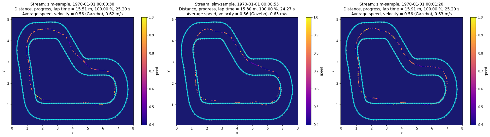
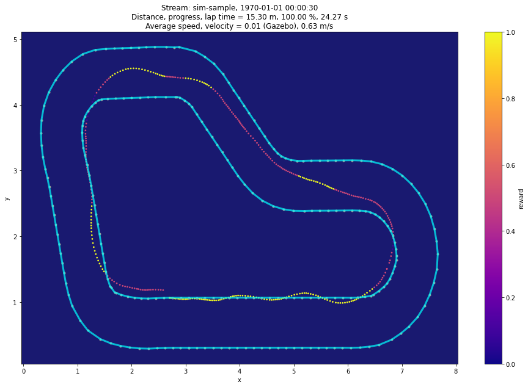

### Imports


```python
import sys

!{sys.executable} -m pip install --upgrade deepracer-utils
```

    Looking in indexes: https://pypi.org/simple, https://pip.repos.neuron.amazonaws.com
    Requirement already satisfied: deepracer-utils in /home/ec2-user/anaconda3/envs/python3/lib/python3.6/site-packages (0.20)
    Requirement already satisfied: boto3>=1.12.0 in /home/ec2-user/anaconda3/envs/python3/lib/python3.6/site-packages (from deepracer-utils) (1.20.23)
    Requirement already satisfied: scikit-learn>=0.22.0 in /home/ec2-user/anaconda3/envs/python3/lib/python3.6/site-packages (from deepracer-utils) (0.24.1)
    Requirement already satisfied: matplotlib>=3.1.0 in /home/ec2-user/anaconda3/envs/python3/lib/python3.6/site-packages (from deepracer-utils) (3.3.4)
    Requirement already satisfied: pandas>=1.0.0 in /home/ec2-user/anaconda3/envs/python3/lib/python3.6/site-packages (from deepracer-utils) (1.1.5)
    Requirement already satisfied: joblib>=0.17.0 in /home/ec2-user/anaconda3/envs/python3/lib/python3.6/site-packages (from deepracer-utils) (1.0.1)
    Requirement already satisfied: python-dateutil<3.0.0,>=2.1 in /home/ec2-user/anaconda3/envs/python3/lib/python3.6/site-packages (from deepracer-utils) (2.8.2)
    Requirement already satisfied: numpy>=1.18.0 in /home/ec2-user/anaconda3/envs/python3/lib/python3.6/site-packages (from deepracer-utils) (1.19.5)
    Requirement already satisfied: shapely>=1.7.0 in /home/ec2-user/anaconda3/envs/python3/lib/python3.6/site-packages (from deepracer-utils) (1.8.0)
    Requirement already satisfied: botocore<1.24.0,>=1.23.23 in /home/ec2-user/anaconda3/envs/python3/lib/python3.6/site-packages (from boto3>=1.12.0->deepracer-utils) (1.23.23)
    Requirement already satisfied: s3transfer<0.6.0,>=0.5.0 in /home/ec2-user/anaconda3/envs/python3/lib/python3.6/site-packages (from boto3>=1.12.0->deepracer-utils) (0.5.0)
    Requirement already satisfied: jmespath<1.0.0,>=0.7.1 in /home/ec2-user/anaconda3/envs/python3/lib/python3.6/site-packages (from boto3>=1.12.0->deepracer-utils) (0.10.0)
    Requirement already satisfied: cycler>=0.10 in /home/ec2-user/anaconda3/envs/python3/lib/python3.6/site-packages (from matplotlib>=3.1.0->deepracer-utils) (0.10.0)
    Requirement already satisfied: pillow>=6.2.0 in /home/ec2-user/anaconda3/envs/python3/lib/python3.6/site-packages (from matplotlib>=3.1.0->deepracer-utils) (8.4.0)
    Requirement already satisfied: kiwisolver>=1.0.1 in /home/ec2-user/anaconda3/envs/python3/lib/python3.6/site-packages (from matplotlib>=3.1.0->deepracer-utils) (1.3.1)
    Requirement already satisfied: pyparsing!=2.0.4,!=2.1.2,!=2.1.6,>=2.0.3 in /home/ec2-user/anaconda3/envs/python3/lib/python3.6/site-packages (from matplotlib>=3.1.0->deepracer-utils) (3.0.6)
    Requirement already satisfied: pytz>=2017.2 in /home/ec2-user/anaconda3/envs/python3/lib/python3.6/site-packages (from pandas>=1.0.0->deepracer-utils) (2021.3)
    Requirement already satisfied: six>=1.5 in /home/ec2-user/anaconda3/envs/python3/lib/python3.6/site-packages (from python-dateutil<3.0.0,>=2.1->deepracer-utils) (1.16.0)
    Requirement already satisfied: scipy>=0.19.1 in /home/ec2-user/anaconda3/envs/python3/lib/python3.6/site-packages (from scikit-learn>=0.22.0->deepracer-utils) (1.5.3)
    Requirement already satisfied: threadpoolctl>=2.0.0 in /home/ec2-user/anaconda3/envs/python3/lib/python3.6/site-packages (from scikit-learn>=0.22.0->deepracer-utils) (2.1.0)
    Requirement already satisfied: urllib3<1.27,>=1.25.4 in /home/ec2-user/anaconda3/envs/python3/lib/python3.6/site-packages (from botocore<1.24.0,>=1.23.23->boto3>=1.12.0->deepracer-utils) (1.26.7)


# Evaluation Analysis


```python

from deepracer.tracks import TrackIO, Track

from deepracer.logs import \
    AnalysisUtils as au, \
    SimulationLogsIO as slio, \
    EvaluationUtils as eu, \
    PlottingUtils as pu , \
    DeepRacerLog

# Ignore deprecation warnings we have no power over
import warnings
warnings.filterwarnings('ignore')
```

## Tracks Available:


```python
!ls tracks/

tu = TrackIO()
```

    Albert.npy			Monaco_building.npy
    AmericasGeneratedInclStart.npy	Monaco.npy
    Aragon.npy			morgan_open.npy
    arctic_open.npy			morgan_pro.npy
    arctic_pro.npy			New_York_Track.npy
    Austin.npy			Oval_track.npy
    AWS_track.npy			penbay_open.npy
    Belille.npy			penbay_pro.npy
    Bowtie_track.npy		red_star_open.npy
    caecer_gp.npy			red_star_pro.npy
    caecer_loop.npy			reInvent2019_track.npy
    Canada_Training.npy		reInvent2019_wide_mirrored.npy
    ChampionshipCup2019_track.npy	reInvent2019_wide.npy
    China_track.npy			reinvent_base.npy
    dubai_open.npy			Singapore_building.npy
    dubai_pro.npy			Singapore_f1.npy
    FS_June2020.npy			Singapore.npy
    hamption_open.npy		Spain_track_f1.npy
    hamption_pro.npy		Spain_track.npy
    H_track.npy			Straight_track.npy
    July_2020.npy			thunder_hill_open.npy
    jyllandsringen_open.npy		thunder_hill_pro.npy
    jyllandsringen_pro.npy		Tokyo_Training_track.npy
    LGSWide.npy			Vegas_track.npy
    London_Loop_Train.npy		Virtual_May19_Train_track.npy
    Mexico_track.npy


## Track used in Evaluation:


```python
track: Track = tu.load_track("reinvent_base")

track.road_poly
```

    Loaded 119 waypoints


## Load all race submission logs


```python
logs = [('logs/barrichello/logs/evaluation/evaluation-20211217203724-skMIZGvWRaiMKMwPCA38eg-robomaker.log', 'sim-sample')]
```


```python
# Loads all the logs from the above time range
bulk = slio.load_a_list_of_logs(logs)
```

## Parse logs


```python
simulation_agg = au.simulation_agg(bulk, 'stream', add_tstamp=True, is_eval=True)
complete_ones = simulation_agg[simulation_agg['progress']==100]
```

## Fastest completed laps


```python
complete_ones.nsmallest(15, 'time')
```


<div>
<table border="1" class="dataframe">
  <thead>
    <tr style="text-align: right;">
      <th></th>
      <th>stream</th>
      <th>episode</th>
      <th>steps</th>
      <th>start_at</th>
      <th>progress</th>
      <th>time</th>
      <th>speed</th>
      <th>time_if_complete</th>
      <th>tstamp</th>
    </tr>
  </thead>
  <tbody>
    <tr>
      <th>1</th>
      <td>sim-sample</td>
      <td>1</td>
      <td>365</td>
      <td>1</td>
      <td>100.0</td>
      <td>24.270</td>
      <td>0.557808</td>
      <td>24.270</td>
      <td>1970-01-01 00:00:55.092</td>
    </tr>
    <tr>
      <th>0</th>
      <td>sim-sample</td>
      <td>0</td>
      <td>381</td>
      <td>1</td>
      <td>100.0</td>
      <td>25.201</td>
      <td>0.555145</td>
      <td>25.201</td>
      <td>1970-01-01 00:00:30.689</td>
    </tr>
    <tr>
      <th>2</th>
      <td>sim-sample</td>
      <td>2</td>
      <td>379</td>
      <td>1</td>
      <td>100.0</td>
      <td>25.203</td>
      <td>0.564908</td>
      <td>25.203</td>
      <td>1970-01-01 00:01:20.424</td>
    </tr>
  </tbody>
</table>
</div>


## Positional plot of all the evaluation laps


```python
pu.plot_evaluations(bulk, track)
```





    <Figure size 432x288 with 0 Axes>


# Fastest lap


```python
fastest_lap = complete_ones.nsmallest(1, 'time')
lap_df = bulk[(bulk['episode']==int(fastest_lap['episode'])) & (bulk['stream']=='sim-sample')]
```


```python
lap_df.loc[:,'distance']=((lap_df['x'].shift(1)-lap_df['x']) ** 2 + (lap_df['y'].shift(1)-lap_df['y']) ** 2) ** 0.5
lap_df.loc[:,'time']=lap_df['tstamp'].astype(float)-lap_df['tstamp'].shift(1).astype(float)
lap_df.loc[:,'speed']=lap_df['distance']/(100*lap_df['time'])
lap_df.loc[:,'acceleration']=(lap_df['distance']-lap_df['distance'].shift(1))/lap_df['time']
lap_df.loc[:,'progress_delta']=lap_df['progress'].astype(float)-lap_df['progress'].shift(1).astype(float)
lap_df.loc[:,'progress_delta_per_time']=lap_df['progress_delta']/lap_df['time']

pu.plot_grid_world(lap_df, track, graphed_value='reward')
```





    <Figure size 432x288 with 0 Axes>

